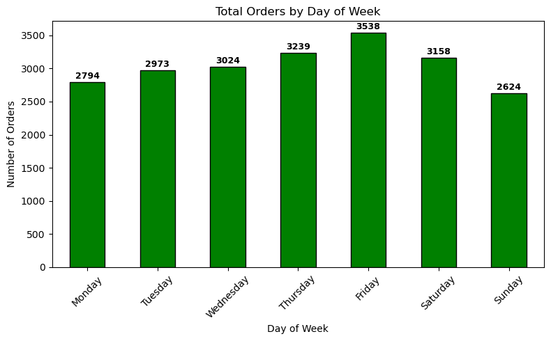
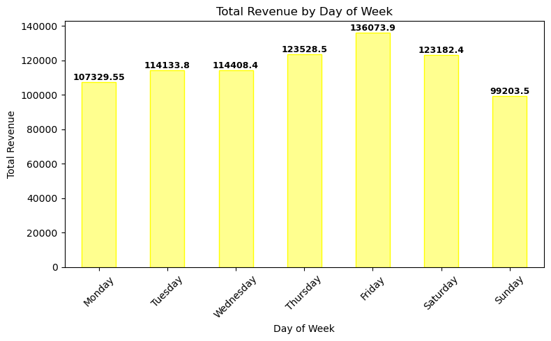
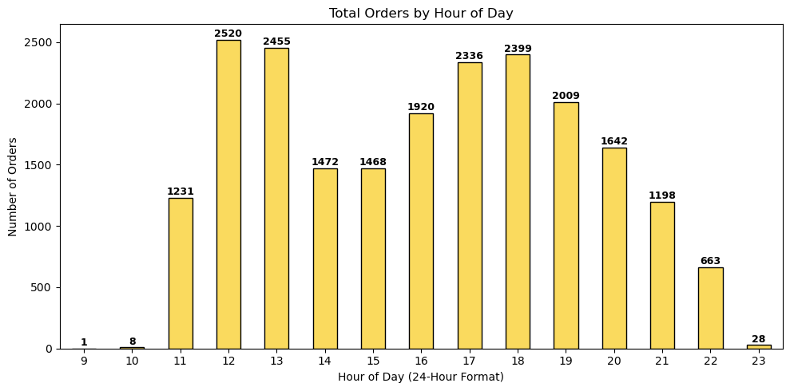
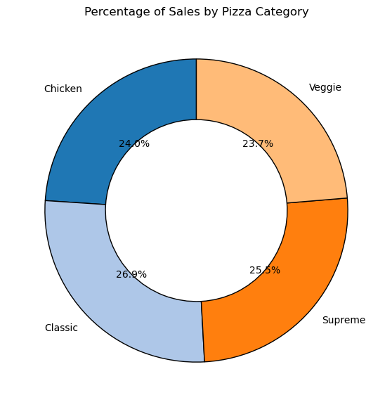
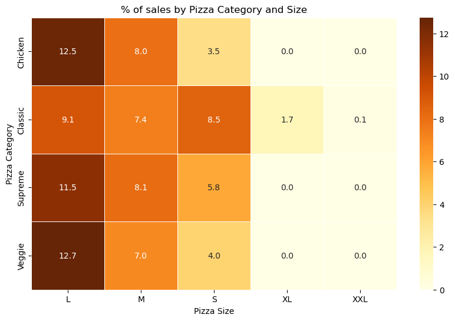

# 🍕 Pizza Sales Analysis — Slices, Sales & Strategy (Data-Driven Insights)

## 📌 Project Overview
This project analyzes transactional sales data from a pizza store to uncover trends, customer behavior, and key performance metrics (KPIs). The goal is to generate actionable insights for **sales, marketing, staffing, and inventory planning**.

## 🎯 Business Objectives
- Identify overall **Revenue**, **Total Pizzas Sold**, and **Total Orders**
- Understand sales distribution by **Category**, **Size**, and **Pizza Type**
- Analyze **time-based trends** (day of week, hour of day, monthly trends)
- Find **top-selling** and **least-selling** pizzas by quantity and revenue
- Calculate customer behavior metrics like **AOV** and **Avg Pizzas per Order**
- Build visualizations for decision-making

## 📂 Dataset
**File:** `pizza_sales.csv`

**Key Columns**
- `order_id` → Unique order identifier  
- `pizza_id` → Unique pizza identifier  
- `pizza_name` → Name of the pizza  
- `quantity` → Number of pizzas in a transaction  
- `total_price` → Total revenue for the transaction  
- `date`, `time` → Order timestamp  
- `pizza_category`, `pizza_size` → Classification attributes  

## 📊 KPIs
- **Total Revenue** = Sum of `total_price`
- **Total Pizzas Sold** = Sum of `quantity`
- **Total Orders** = Count of unique `order_id`
- **Average Order Value (AOV)** = Total Revenue ÷ Total Orders
- **Avg Pizzas per Order** = Total Pizzas Sold ÷ Total Orders

## 🔍 Key Analysis Performed
### 1) Sales by Pizza Category
Classic, Supreme, Chicken, Veggie — compares total pizzas sold and % contribution.

### 2) Daily Trend (Orders + Revenue by Day of Week)
Helps plan staffing and operations.

### 3) Hourly Trend (Orders by Hour)
Identifies peak rush hours for staffing + prep planning.

### 4) Sales by Category and Size (Heatmap)
Shows which size drives sales in each category.

## 📸 Visualizations
> Add your plots here after uploading them into `/images`

**Total Pizzas Sold by Category**

**Orders by Day**

**Revenue by Day**

**Orders by Hour**

**% Sales by Category**

**% Sales by Category & Size**

## 💡 Business Insights (Example Summary)
- Classic category contributes the highest share of sales.
- Friday shows the highest orders and revenue → peak staffing day.
- Lunch (12–13) and evening (17–19) are the busiest hours.
- Large (L) pizzas are the strongest contributors across categories.

## ✅ Recommendations
- Run promotions around peak days (Thu–Sat), especially Friday.
- Optimize staffing around lunch + evening rush hours.
- Stock ingredients more aggressively for high-performing categories and large-size demand.
- Review least-selling pizzas for menu optimization or bundling.

## 🛠 Tools & Technologies
- Python (Pandas, NumPy)
- Matplotlib / Seaborn
- Jupyter Notebook

