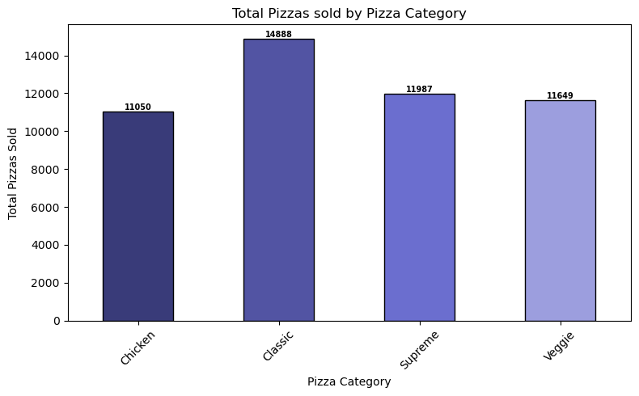
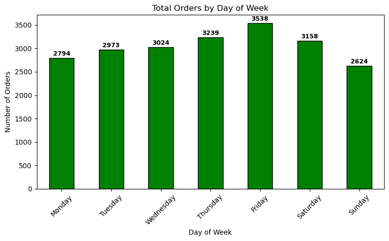
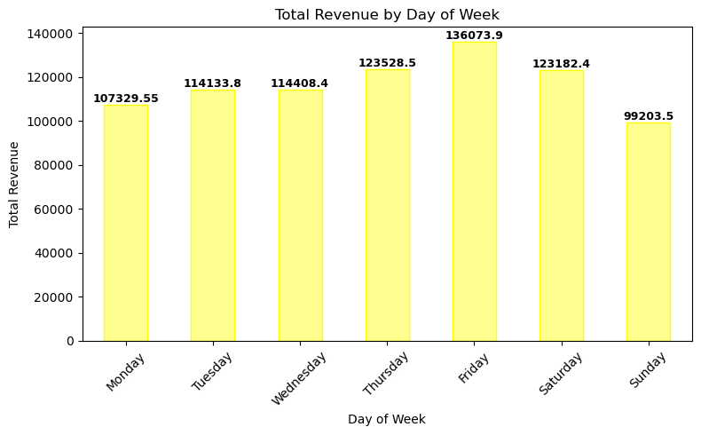
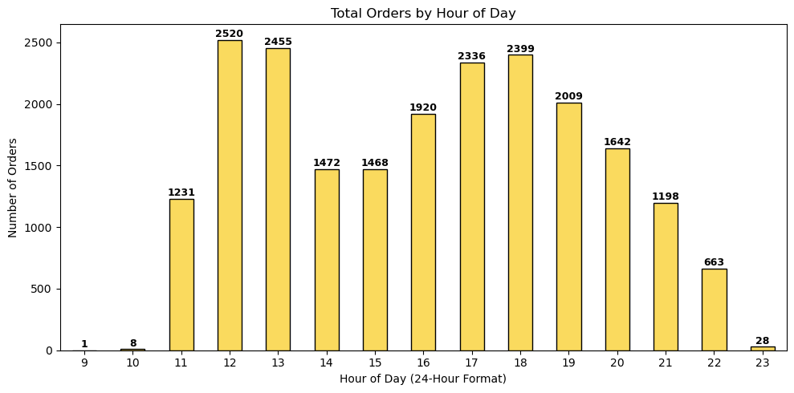
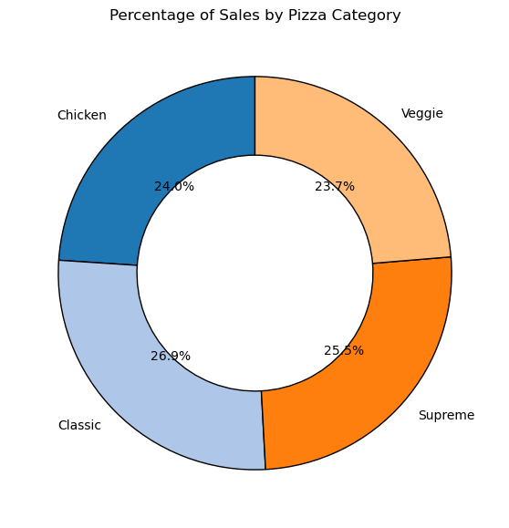
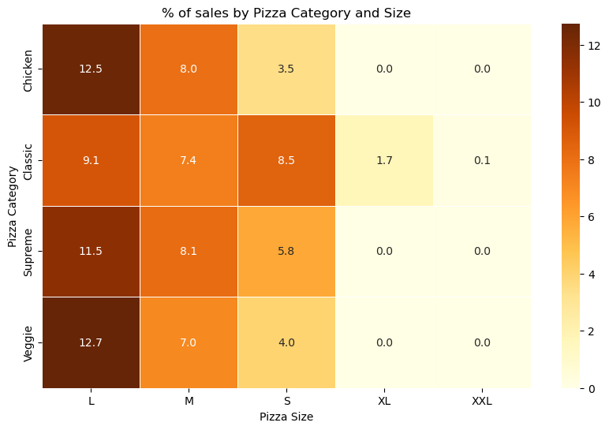

# 🍕 Pizza Sales Analysis — Slices, Sales & Strategy


---

```
         🍕  What sells? When? Why? How much?
              One dataset. Five business questions.
                    Real answers.
```

---

## 📖 The Story Behind This Project

A pizza store has data — thousands of orders, dozens of pizza types, a full year
of transactions. But raw data doesn't answer the questions that matter:

- *Should we hire an extra person on Fridays?*
- *Is the Veggie category worth keeping on the menu?*
- *What time should we start prepping dough?*

This project takes transactional sales data and turns it into **specific, 
actionable answers** for sales, staffing, inventory, and marketing teams.

---

## 🎯 Five Business Questions This Project Answers

```
1.  How much revenue did we make — and what drove it?
2.  Which pizzas and categories are actually worth keeping?
3.  When are customers most likely to order?
4.  What size do customers prefer — and does it vary by category?
5.  Where should we focus promotions and staffing investment?
```

---

## 📂 Dataset

**File:** `pizza_sales.csv`

| Column | Type | Description |
|---|---|---|
| `order_id` | INT | Unique identifier per order |
| `pizza_id` | STRING | Unique identifier per pizza |
| `pizza_name` | STRING | Name of the pizza |
| `pizza_category` | STRING | Classic · Supreme · Chicken · Veggie |
| `pizza_size` | STRING | S · M · L · XL · XXL |
| `quantity` | INT | Number of pizzas per transaction |
| `total_price` | FLOAT | Revenue generated per transaction |
| `date` | DATE | Order date |
| `time` | TIME | Order timestamp |

---

## 📊 KPIs Tracked

| KPI | Formula | Why It Matters |
|---|---|---|
| **Total Revenue** | `SUM(total_price)` | Overall business health |
| **Total Pizzas Sold** | `SUM(quantity)` | Volume and demand signal |
| **Total Orders** | `COUNT(DISTINCT order_id)` | Customer frequency |
| **Average Order Value** | `Revenue ÷ Orders` | Spend per customer visit |
| **Avg Pizzas per Order** | `Pizzas Sold ÷ Orders` | Basket size indicator |

---

## 🔍 Analysis Breakdown

### 1 · Sales by Category
> *Which category is pulling its weight?*

Compared Classic, Supreme, Chicken, and Veggie by total pizzas sold and
percentage revenue contribution. Identifies underperforming categories
worth reconsidering on the menu.

---

### 2 · Daily Trend — Orders & Revenue by Day of Week
> *Which day should we put our best staff on shift?*

Aggregated orders and revenue by day of week to surface peak operational
days. Directly informs staffing rosters and promotional timing.

---

### 3 · Hourly Trend — Orders by Hour of Day
> *When does the kitchen need to be ready?*

Mapped order volume across every hour to identify morning, lunch, and
evening rush windows. Useful for prep scheduling and staffing allocation.

---

### 4 · Category × Size Heatmap
> *Do Chicken pizza customers prefer Large? Do Veggie customers go Small?*

A heatmap of quantity sold by category and size reveals which combinations
drive volume — and which size investments are worth making per category.

---

## 📸 Visualizations

| Chart | What It Shows |
|---|---|
|  | Total pizzas sold per category |
|  | Order volume by day of week |
|  | Revenue by day of week |
|  | Peak and off-peak hours |
|  | % revenue share by category |
|  | Size × category sales matrix |

> 📁 All chart images are stored in the `/images` folder.

---

## 💡 Key Findings

```txt
🏆  Classic is the top category — highest volume and revenue share
📅  Friday is peak day — highest orders AND revenue of the week
🕛  Lunch (12–13:00) and evening (17–19:00) are the two rush windows
📏  Large (L) is the dominant size across all categories
📉  Least-selling pizzas represent menu clutter worth reviewing
```

---

## ✅ Recommendations

**For Operations & Staffing**
- Schedule maximum staff on **Thursday through Saturday**, with Friday as the priority
- Ensure kitchen is fully prepped by **11:30 AM** (before the 12:00 lunch spike)
- Staff evening window from **16:30** to cover the 17–19:00 rush

**For Sales & Marketing**
- Run promotions mid-week (Monday–Wednesday) to lift the slowest revenue days
- Bundle least-selling pizzas with top sellers to reduce menu dead weight
- Focus upsell efforts on **Large size** — already the customer preference

**For Inventory & Supply Chain**
- Stock ingredients more aggressively for **Classic category and Large size**
- Reduce prep for underperforming Veggie variants based on actual sell-through
- Use hourly trend data to time fresh ingredient delivery windows

---

## 🛠️ Tools Used

| Tool | Purpose |
|---|---|
| Python | End-to-end analysis scripting |
| Pandas | Data loading, cleaning, grouping, aggregation |
| NumPy | Numerical operations and calculations |
| Matplotlib | Bar charts, line charts, time-series plots |
| Seaborn | Heatmaps, styled statistical visualizations |
| Jupyter Notebook | Interactive analysis and narrative documentation |

---

## 📁 Project Structure

```
pizza-sales-analysis/
│
├── pizza_sales_analysis.ipynb   ← Main analysis notebook
│
├── data/
│   └── pizza_sales.csv          ← Raw dataset
│
├── images/
│   ├── total_pizzas_by_category.png
│   ├── orders_by_day.png
│   ├── revenue_by_day.png
│   ├── orders_by_hour.png
│   ├── sales_category_donut.png
│   └── sales_heatmap.png
│
└── README.md
```

---

## 🚀 How to Run

```bash
# Clone the repository
git clone https://github.com/pournima2413/pizza-sales-analysis
cd pizza-sales-analysis

# Install dependencies
pip install pandas numpy matplotlib seaborn jupyter

# Launch the notebook
jupyter notebook pizza_sales_analysis.ipynb
```

---

## 💼 Skills Demonstrated

```txt
✅  Exploratory Data Analysis (EDA) on real transactional data
✅  KPI definition and calculation from raw fields
✅  Time-series analysis — hourly, daily, and monthly trends
✅  Category and size segmentation using groupby and pivot tables
✅  Business insight generation from statistical findings
✅  Actionable recommendation writing for non-technical stakeholders
✅  Multi-chart visualization layout using Matplotlib and Seaborn
```

---

## 🔗 Connect

**Pournima Kamble** — MS Computer Science @ Cleveland State University (2026)
Seeking Data Analyst & Data Engineer roles · Available June 2026

[](https://linkedin.com/in/pournimakamble)
[](https://github.com/pournima2413)
[](mailto:pournima2413@gmail.com)
